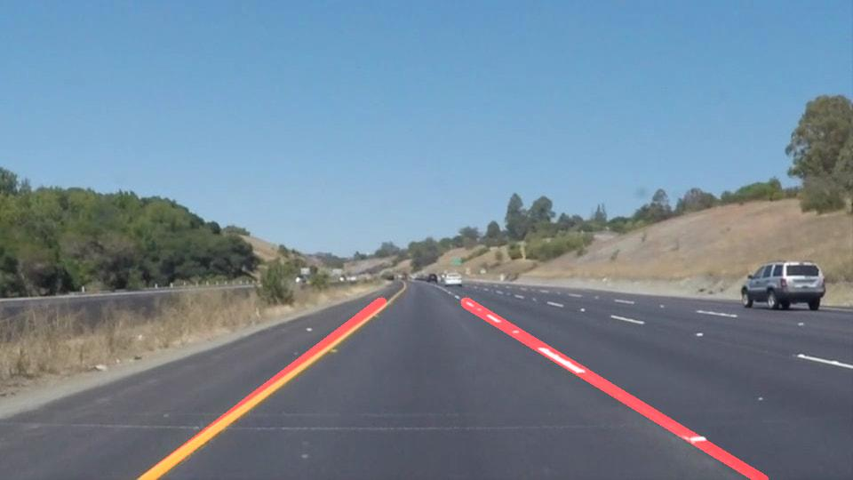

# **Finding Lane Lines on the Road** 

---

**Approach**
The main aim of the project is to detect road lane markings on straight roads. The steps involved in the process are: 
 1. Smoothing: Smoothing is used to remove sharp noise from images so we can have stable gradients
 2. Edge detection: Gradient based methods are used to detect all the edges in image
 3. Lane Mask: Manually defined region with potential lines.
 4. Hough Transform: Used Hough Transform to find straight lines among several edges.
 5. Linear Regression: Find the best fit line among the several lines using linear regression.
 6. Image Masking: Plotting the best fit lane lines on the actual image


* Create image processing pipeline to find lane lines Below are the steps involved
    * Converting image to gray Scale
    * Smoothing the image with 3x3 gaussian filter
        * Threshold (75,150)
    * Using the blurred image to find all edges using canny edge detector
    * From images of edges keep only selected edges with region on interest,
    * For all edges in region of interest, find the candidates line using Hough transform.
        ```python 
            rho = 1
            theta = np.pi/180
            threshold = 50
            min_line_len = 30
            max_line_gap = 15
        ```
    * Among the candidates lines, find the best fit line using linear regression among the X and Y points
    * Use the slope and intercept from linear regression to draw Actual line on the image


## Lane markings with Linear Regression
With Hough transform, many of unwanted edges were removed but still few of the lines remained instead of two solid lines. Since I had the starting and ending X and Y cordinates of all the lines, I turned this task into a simple machine learning problem.
* Get the list of all the x and y cordinates from the hough transform lines, divide the co ordinates based on positive slope and negative slope into two sub lists, left and right.
* On both the sublist trained an algorithm to find the best fit line y given x 
* with the help of linear regression I calculated the slope and intercept of the best fit line.
* Used the slope and intercept to calculate points on the image thus ended up with only two lines.

## Results


## Limitations and Improvements
- Linear Regression does not work on lanes lines with curves, polyfit of 2 degree would work but add complexity
- The algorithm is not robust to Occlusions
- Outlies from Hough transform causes error in lane lines
- Smarter way of selecting region of interest

[//]: # (Image References)

[image1]: ./examples/grayscale.jpg "Grayscale"

